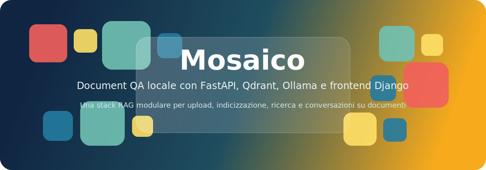

<p align="center">
  
</p>

<h1 align="center">Mosaico</h1>

<p align="center">
  Stack locale per <strong>Document QA</strong> e <strong>chat RAG</strong> con
  <code>FastAPI</code>, <code>Qdrant</code>, <code>Ollama</code> e <code>Django</code>.
</p>

<p align="center">
  <a href="./ai_api/README.md">API</a> •
  <a href="./mosaico/README.md">Frontend</a> •
  <a href="./qdrant_project/README.md">Qdrant</a> •
  <a href="./ollama_project/README.md">Ollama</a>
</p>

<p align="center">
  
  
  
  
</p>

## Panoramica

Mosaico e una piattaforma modulare per interrogare documenti in locale tramite una pipeline RAG completa: upload dei file, estrazione e chunking del testo, indicizzazione vettoriale su Qdrant e generazione delle risposte con Ollama.

La repository separa chiaramente i componenti applicativi dai servizi di infrastruttura, cosi puoi avviare, evolvere o sostituire ogni blocco in modo indipendente.

## Cosa include

| Modulo | Ruolo | Porta predefinita |
| --- | --- | --- |
| [`ai_api/`](./ai_api/README.md) | API FastAPI per upload, indicizzazione, chat RAG, JWT e multi-tenant | `9000` |
| [`mosaico/`](./mosaico/README.md) | Frontend Django per autenticazione, upload, chat e gestione collection | `9001` |
| [`qdrant_project/`](./qdrant_project/README.md) | Stack Docker minimale per Qdrant | `6333` |
| [`ollama_project/`](./ollama_project/README.md) | Stack Docker per Ollama e modelli locali | `11434` |
| [`postgres_project/`](./postgres_project/docker-compose.yml) | Stack Docker per PostgreSQL opzionale | `5433 -> 5432` |

## Funzionalita principali

- **Chat RAG con streaming** — le risposte appaiono token per token tramite SSE, eliminando l'attesa
- **Upload multipli** — seleziona piu file contemporaneamente con barra di progresso per ciascuno
- **Formati supportati** — `.txt`, `.pdf`, `.doc`, `.docx`, `.xls`, `.xlsx`, `.json`
- **Gestione conversazioni** — elimina o esporta in Markdown qualsiasi conversazione dalla sidebar
- **Auto-pull modello Ollama** — con Ollama locale, il modello configurato viene scaricato automaticamente al primo avvio
- **Multi-tenant** — isolamento per `username` e `collection` tramite namespace Qdrant
- **Database duale** — SQLite in sviluppo, PostgreSQL in produzione
- **Interfaccia bilingue** — selettore lingua (Italiano/Inglese) persistito in sessione; tutte le pagine e i messaggi JS si adattano dinamicamente
- **Pipeline RAG migliorata** — chunking sentence-aware, soglia score adattiva, budget history in caratteri, reranker cross-encoder opzionale, MMR lambda configurabile

## Architettura

```text
Browser
  |
  v
Frontend Django (:9001)
  |
  v
API FastAPI (:9000)
  |--------------------> Qdrant (:6333)
  |--------------------> Ollama (:11434)
  |
  +--------------------> PostgreSQL (:5433, opzionale)
```

## Quick Start

### Prerequisiti

- **Docker** e **Docker Compose** v2+ (incluso in Docker Desktop)
- Python 3.11+ solo se vuoi eseguire API o frontend fuori dai container

### 1. Configurazione iniziale

```bash
cp .env.example .env
# Edita .env: imposta OLLAMA_URL, OLLAMA_MODEL, credenziali DB, ecc.
```

Le variabili piu importanti da verificare prima del primo avvio:

| Variabile | Esempio | Note |
|---|---|---|
| `OLLAMA_URL` | `http://192.168.1.10:11434/api/generate` | URL del server Ollama esterno (scenario `up`) |
| `OLLAMA_MODEL` | `gemma3:1b` | Modello da usare/scaricare |
| `API_BASE` | `http://localhost:9000` | Come il frontend raggiunge l'API |
| `DJANGO_SECRET_KEY` | *(stringa casuale)* | Obbligatorio in produzione |

---

### 2. Avvio dello stack completo

Il `docker-compose.yml` nella root orchestra tutti i servizi: Qdrant, PostgreSQL, API FastAPI e Frontend Django.

Sono disponibili due scenari a seconda di dove gira Ollama.

#### Scenario A — Ollama su server esterno (piu comune)

Usa quando hai gia Ollama in esecuzione su un'altra macchina o su localhost fuori da Docker.
`OLLAMA_URL` nel `.env` punta a quel server.

```bash
# Linux / macOS
make up

# Windows (PowerShell)
.\start.ps1 up
```

Equivalente Docker puro:
```bash
docker compose up -d --build
```

#### Scenario B — Ollama locale nel container Docker

Usa quando vuoi che Ollama giri anch'esso in Docker. Al primo avvio il modello `OLLAMA_MODEL` viene scaricato automaticamente dal servizio `ollama-pull`; i riavvii successivi saltano il download grazie al volume `ollama_data`.

```bash
# Linux / macOS
make local

# Windows (PowerShell)
.\start.ps1 local
```

Equivalente Docker puro (sovrascrive OLLAMA_URL inline):
```bash
OLLAMA_URL=http://ollama:11434/api/generate docker compose --profile local up -d --build
```

> Su Windows (cmd/PowerShell senza `make`) usa `.\start.ps1 local` oppure imposta la variabile d'ambiente manualmente prima del comando `docker compose`.

---

### 3. Comandi di gestione

Tutti i comandi sono disponibili sia via `make` (Linux/macOS) sia via `start.ps1` (Windows).

| Azione | `make` | `start.ps1` | Docker puro |
|---|---|---|---|
| Avvia (Ollama esterno) | `make up` | `.\start.ps1 up` | `docker compose up -d --build` |
| Avvia (Ollama locale) | `make local` | `.\start.ps1 local` | `OLLAMA_URL=http://ollama:11434/api/generate docker compose --profile local up -d --build` |
| Ferma tutto | `make down` | `.\start.ps1 down` | `docker compose --profile local down` |
| Log in tempo reale | `make logs` | `.\start.ps1 logs` | `docker compose --profile local logs -f` |

> `make down` e `.\start.ps1 down` fermano anche i container del profilo `local` (Ollama + ollama-pull) se erano stati avviati.

---

### 4. Primo accesso

Dopo l'avvio (attendere 20-30 secondi per l'inizializzazione):

1. Apri il browser su **`http://localhost:9001`**
2. Registra un account (o usa il superuser creato con `createsuperuser`)
3. Vai su **Upload** e carica un documento
4. Vai su **Chat** e inizia a interrogare la knowledge base

---

### 5. Avvio per moduli (alternativa avanzata)

Se preferisci avviare i componenti separatamente o hai un'infrastruttura parzialmente esistente:

```bash
# 1. Qdrant
cd qdrant_project && docker compose up -d

# 2. Ollama (con pull manuale del modello)
cd ollama_project && docker compose up -d
docker compose exec ollama ollama pull gemma3:1b

# 3. PostgreSQL (opzionale — l'API usa SQLite di default)
cd postgres_project && docker compose up -d

# 4. API FastAPI e Frontend Django
cd ai_api   && docker compose up -d --build
cd mosaico  && docker compose up -d --build
```

Per la configurazione dettagliata di ogni modulo consulta:
[`ai_api/README.md`](./ai_api/README.md) · [`mosaico/README.md`](./mosaico/README.md) · [`qdrant_project/README.md`](./qdrant_project/README.md) · [`ollama_project/README.md`](./ollama_project/README.md)

---

### 6. Cambio modello Ollama

```bash
# Scarica il nuovo modello nel container
docker compose exec ollama ollama pull <nuovo-modello>

# Aggiorna OLLAMA_MODEL nel .env, poi riavvia
make local   # oppure .\start.ps1 local
```

## Endpoint principali

| Servizio | URL |
| --- | --- |
| API FastAPI | `http://localhost:9000` |
| Swagger API | `http://localhost:9000/docs` |
| Frontend Django | `http://localhost:9001` |
| Qdrant | `http://localhost:6333` |
| Ollama | `http://localhost:11434` |
| PostgreSQL | `localhost:5433` |

## Endpoint API notevoli

| Metodo | Path | Descrizione |
| --- | --- | --- |
| `POST` | `/upload` | Carica e indicizza un documento |
| `POST` | `/chat` | Chat RAG (risposta completa JSON) |
| `POST` | `/chat/stream` | Chat RAG con streaming SSE (token progressivi) |
| `GET` | `/uploads` | Cronologia upload |
| `GET` | `/conversations` | Elenco conversazioni |
| `DELETE` | `/conversations/{id}` | Elimina una conversazione |
| `GET/PUT/DELETE` | `/collection/config` | Configurazione collection |
| `GET` | `/healthz` | Health check completo |
| `GET` | `/docs` | Swagger UI |

## Perche questa struttura

- Isola UI, API e infrastruttura in moduli separati.
- Permette di usare SQLite in sviluppo e PostgreSQL quando serve persistenza piu robusta.
- Mantiene locale l'intera catena RAG, incluse embedding, retrieval e generazione.
- Riduce l'accoppiamento tra componenti e rende piu semplice il deploy per ambienti diversi.

## Documentazione

- [`ai_api/README.md`](./ai_api/README.md) per API, configurazione, database, endpoint e testing.
- [`mosaico/README.md`](./mosaico/README.md) per frontend, autenticazione e interfaccia.
- [`qdrant_project/README.md`](./qdrant_project/README.md) per il servizio vettoriale.
- [`ollama_project/README.md`](./ollama_project/README.md) per il serving dei modelli locali.

## Stato del progetto

Il modulo API e stato rinominato da `mosaico_api/` a `ai_api/`. Tutta la documentazione e i link sono stati aggiornati di conseguenza.

Funzionalita aggiunte nella revisione corrente: streaming SSE su `/chat/stream`, upload multipli con progress per-file, eliminazione ed esportazione conversazioni, supporto file `.json`, pull automatico del modello Ollama al primo avvio, script `start.ps1` per Windows.

Revisione successiva:
- **UI upload** riprogettata a due pannelli (configurazione collection a sinistra, dropzone a destra).
- **Storico caricamenti** con paginazione server-side (parametro `offset`) e selezione righe per pagina.
- **i18n IT/EN**: selettore lingua in navbar, dizionari in `ui/i18n.py`, context processor `ui.context_processors.i18n`; tutte le pagine usano `{{ t.chiave }}` e blocchi JS `UI`.
- **Qualita RAG**: chunking sentence-aware, soglia score adattiva con fallback progressivo, budget in caratteri per la history (`CHAT_HISTORY_CHAR_BUDGET`), truncation sentence-aware nel contesto, `MMR_LAMBDA` configurabile, reranker cross-encoder opzionale (`ENABLE_CROSS_ENCODER_RERANK`).
